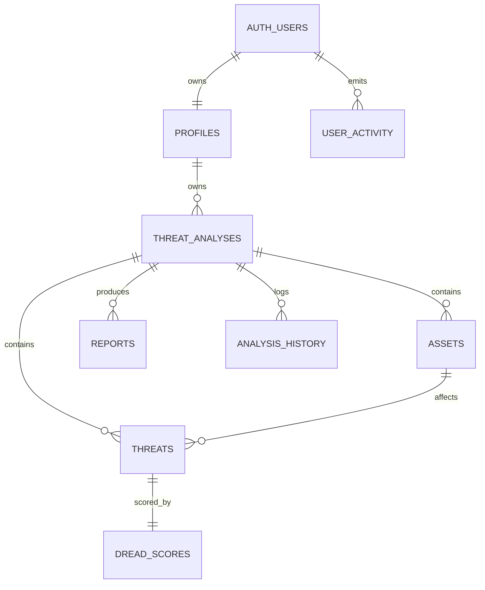

# ThreatLens AI Supabase Production Readiness Audit

Audit date: 2026-06-11
Project: `threatlensAI` (`nrbaqtgwwbnfukhesnht`, `ap-south-1`, Postgres 17)

## Findings First

Launch recommendation: NEEDS MINOR FIXES

The schema is close to MVP-ready: all app tables have RLS enabled, ownership is modeled, core foreign keys exist, trigger functions set explicit `search_path`, and no orphaned domain records were found. The biggest blockers are operational/security hardening issues rather than schema absence: no recorded migrations, no deployed Edge Functions, leaked-password protection disabled, one auth user without a profile row, broad default grants to `anon`, inefficient RLS expressions, and duplicate indexes.

Scores:

- Security: 7/10
- Performance: 6/10
- Scalability: 6/10
- Maintainability: 6/10
- Production readiness: 6/10

## Critical Issues

None found that prove live cross-user data exposure. RLS is enabled and the policies consistently check `auth.uid()` ownership.

## High Priority Issues

- No Edge Functions are deployed. The app documentation says all AI calls must go through Supabase Edge Functions, but the project currently lists zero functions. Without them, production AI workflows are not ready.
- No Supabase migrations are recorded. Production schema exists, but it is not reproducibly managed through migrations.
- Leaked password protection is disabled. Supabase advisor warns that compromised-password checks are off.
- One `auth.users` row has no matching `public.profiles` row. The profile trigger exists, so this is likely legacy data or a failed trigger execution.
- `anon` has broad table grants on all public app tables. RLS currently prevents access because policies are only for `authenticated`, but least privilege should still revoke `anon` table access.

## Medium Priority Issues

- All app RLS policies call `auth.uid()` directly. Supabase performance advisor flags this because it can be evaluated per row. Use `(select auth.uid())` in policies.
- Duplicate foreign-key indexes exist on `analysis_history.analysis_id`, `assets.analysis_id`, `dread_scores.threat_id`, `reports.analysis_id`, `threat_analyses.user_id`, `threats.analysis_id`, and `threats.asset_id`.
- Trigger functions `set_updated_at` and `dread_scores_set_totals_and_risk` grant `EXECUTE` to `anon` and `authenticated`. They are trigger-only functions and should not be directly executable by API roles.
- `authenticated` has unnecessary `TRUNCATE`, `TRIGGER`, and `REFERENCES` grants on app tables.
- `user_activity` allows authenticated inserts/selects but not update/delete, which is good. It is not yet used as a full immutable audit log because client-side users can insert their own events.

## Low Priority Issues

- Several advisor-reported unused indexes may simply be unused because the project has little data and little traffic. Do not drop them solely from early usage stats.
- `reports.generated_at`, `analysis_history.created_at`, `threat_analyses.status`, `threats.stride_category`, and `dread_scores.risk_level` indexes should be retained only if product queries filter or sort by those fields.
- `profiles.full_name` is `not null`; the trigger inserts an empty string when metadata is missing. That is safe, but a nullable display name may be more flexible.

## Inventory

Schemas observed:

- App schema: `public`
- Supabase managed schemas include `auth`, `storage`, `realtime`, `extensions`, and internal schemas.

Public tables:

- `profiles`: user profile, PK/FK `id -> auth.users(id)`, RLS enabled.
- `threat_analyses`: user-owned analysis root, FK `user_id -> profiles(id)`, RLS enabled.
- `assets`: child of `threat_analyses`, FK `analysis_id`, RLS enabled.
- `threats`: child of `threat_analyses` and `assets`, FKs `analysis_id`, `asset_id`, RLS enabled.
- `dread_scores`: one score per threat, FK `threat_id`, unique `threat_id`, score/risk checks, RLS enabled.
- `reports`: child of `threat_analyses`, FK `analysis_id`, RLS enabled.
- `analysis_history`: child of `threat_analyses`, FK `analysis_id`, RLS enabled.
- `user_activity`: child of `auth.users`, FK `user_id`, event-type check, RLS enabled.

Views: none in `public`.

Functions:

- `handle_new_user()`: `SECURITY DEFINER`, `search_path=pg_catalog`, inserts `public.profiles`.
- `rls_auto_enable()`: `SECURITY DEFINER`, `search_path=pg_catalog`, event trigger helper for new public tables.
- `set_updated_at()`: `SECURITY INVOKER`, `search_path=pg_catalog`, trigger helper.
- `dread_scores_set_totals_and_risk()`: `SECURITY INVOKER`, `search_path=pg_catalog`, trigger helper.

Triggers:

- `auth.users.handle_new_user_trigger`: after insert, calls `handle_new_user()`.
- `profiles.set_profiles_updated_at`: before update, calls `set_updated_at()`.
- `threat_analyses.set_threat_analyses_updated_at`: before update, calls `set_updated_at()`.
- `dread_scores.dread_scores_set_totals_and_risk_trg`: before insert/update of score fields.

RLS policy coverage:

- `profiles`: select/insert/update/delete own row.
- `threat_analyses`: select/insert/update/delete where `user_id = auth.uid()`.
- `assets`, `reports`, `analysis_history`: select/insert/update/delete through owned `threat_analyses`.
- `threats`: select/insert/update/delete through owned `threat_analyses`.
- `dread_scores`: select/insert/update/delete through owned threat and analysis.
- `user_activity`: select/insert own rows only.

Relationship map:

## Authentication Audit

- Email verification cannot be fully confirmed from SQL config, but current data has 1 user and 0 confirmed users.
- Password reset exists in Flutter code through `resetPasswordForEmail`.
- Signup exists through Supabase Auth, but profile synchronization has a gap: 1 user missing a profile.
- Session management exists in Flutter code via `SessionManager`, secure storage, refresh handling, and logout wipe.
- Password policies are not verifiable from catalog metadata through this audit.
- Leaked password protection is disabled according to Supabase security advisor.

## Production Feature Decisions

- `audit_logs`: required soon. `user_activity` is user-visible activity, not a tamper-resistant audit log for security/admin events.
- `notifications`: not required for MVP unless reports/analyses become asynchronous or collaborative.
- `usage_tracking`: recommended because AI usage has cost and abuse implications.
- `api_keys`: not required for MVP mobile-only usage; required if external integrations or CLI/API access are planned.
- `subscriptions`: not required for MVP validation; needed before monetization.
- `feature_flags`: useful but optional; recommended before rolling out expensive AI model changes.
- `user_settings`: recommended for production UX, notification preferences, and privacy controls.

## SQL

Review the separate migration file:

`supabase/migrations/20260611143000_production_readiness_recommendations.sql`

It is intentionally not applied to production by this audit.
